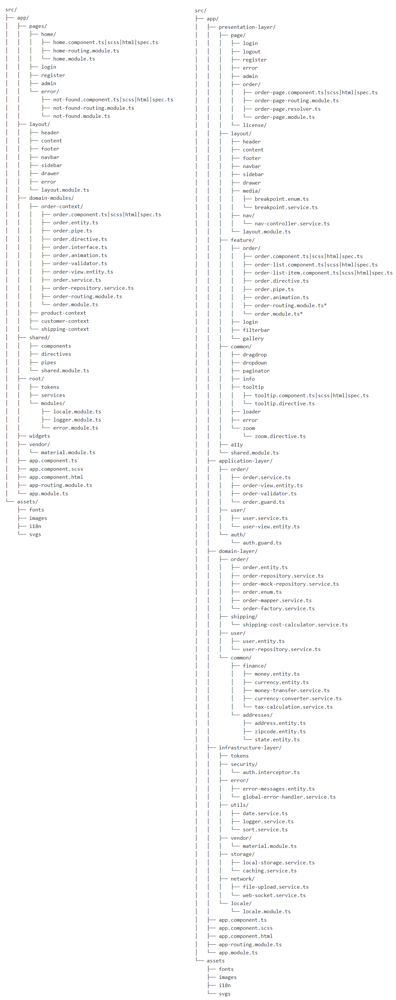
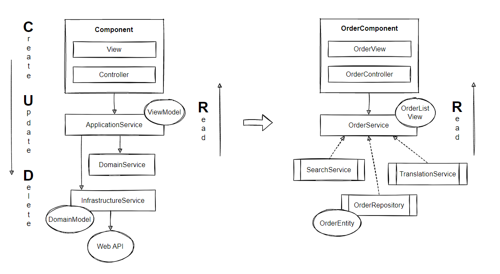

# Introduction <span style="color:red">(WIP) </span>
A brief and practical introduction into building large-scale enterprise business applications with Angular.

# Application Architecture

Conforming to the principles of Object-Oriented Design, Domain-Driven Design and Command-Query-Responsibility-Segregation, we break down complex requirements
into logical boundaries and divide business logic into layers with different responsibilities to keep our code in good condition.

# Frontend coupled to OOD, DDD and CQRS

The building blocks of Angular already provides us with code organisation strategies. Nevertheless, to gain a better design we will bypass the
traditional data-centric approach and consider building blocks of Domain-Driven Design for frontend applications:


## Object-Oriented Design

Although functional programming has gained a strong foothold in frontend development in recent years, a consistent object-oriented approach might be better
suited for TypeScript projects. Object-oriented programming allows us to build a more human-readable code base, where the Ubiquitous Language helps us to
define better semantics and complex data types. Domain-Driven Design and the Angular framework embrace both paradigms.

**» SOLID Principles**<br/>

In Object-oriented programming the SOLID principles of class design helps us to make better design decisions regarding high cohesion and low coupling.
Adhering to the Dependency Inversion Principle (DIP), we ensure that layers depend on abstraction as opposed to depending on concretion (Programming to an Interface).
This means that high-level modules (application layer) shouldn't depend on low-level modules (domain layer). Both layers should depend on abstractions.

**» Cross-Cutting Concerns**<br/>

Frontend applications also include cross-cutting concerns such as logging, tracing or security. A naive approach to implement cross-cutting
functionality usually leads to duplicated or coupled code, which violates Don't Repeat Yourself and the Single Responsibility Principle.
The Aspect Oriented Programming promotes an abstraction and encapsulation of cross-cutting concerns by interlacing additional code,
resulting in loose coupling between the actual logic and infrastructure logic.

## Applying Domain-Driven Design to Angular

A central concept of Domain-Driven Design is that the domain model is kept isolated from other concerns of the application. Ideally, the
domain model is self-contained and focused on abstracting the business domain. Typically, frontend business applications validate business rules that
are reflected in the presentation layer, especially in SPAs when navigating through HTML forms that have cross-dependencies in terms of composite business rules.

As an example, in an ecommerce system, say the business demands that: "no order should be accepted, if the order items are less than 3".
Adhering to this business rule, we wouldn't display the |place order| button, if the basket is empty. Other examples include offline applications (PWAs)
where a considerable part of the business logic may need to be replicated to the client side. Examples of such applications are stock trading applications or tax applications.

An isolated domain layer allows us to avoid domain logic leaking into other layers or surrounding services. In addition, we don't want to perform against
the server upon every user action. Therefore, considering the domain layer pattern in frontend applications sounds like a good idea!

It's fairly debatable whether higher granularity distributed across several layers introduce extra complexity in frontend architectures. Consequently,
many developers tend to lean toward weaker patterns because they see it as an unnecessary practice. For most web applications MVC or Flux/Redux are patterns,
that better meet your needs. Before starting using advanced concepts we should validate incoming requirements.

## Layered Architecture

Considering multilayered architectures, the question arises of how to organize multiple layers in SPAs? This question refers to code splitting,
communication across several layers and demanding business logic from services.

The multilayered architecture in DDD embraces the following conceptional layers:

**» Horizontal slicing**<br/> Slicing the application into layers...


**» Vertical slicing**<br/> Slicing the application into features / use cases / bounded contexts...


**» Cross slicing**<br/> Slicing the application into modules...


Domain-oriented layering is often considered the first structuring criterion in Angular applications. For many applications however, horizontal slicing is sufficient
because vertical slicing isn't mandatory. The main reasons for modular segmentation in Angular applications are lazy-loading, scoping and distribution.

**» Abstraction Layers**<br/>

- Presentation Layer: View Components, UI Services
- Application Layer: Use Case Services, View Models (Providers), Factories <br/>
- Domain Layer: Entities, Value Objects, Collections, Factories, Domain Services <br/>
- Infrastructure Layer: Repositories <br/>

**» Service Layers**<br/>

- User Interface services carry out dialog, navigation and interaction concepts
- Application services carry out business use cases and are stateless and procedural
- Domain services carry out business processes that don't fit inside entities or value objects
- Infrastructure services helps us to separate technical concepts from business concepts <br/>

**» Validation Layers**<br/>

- Application layer (Data Validation Errors): Data types (null, undefined), format (length, empty, whitespace), schema (email, credit-card)
- Domain layer (Business Rule Violations): Business Rules, Business Invariants<br/>
- Infrastructure layer: JSON, XML and String serialization<br/>

**» Angular Adoption**<br/>

- Presentation layer: Components, Directives, Pipes, Animations, UI Modules
- Application layer: Services, Resolvers, Guards, Validator Functions, Factories <br/>
- Domain layer: Classes, Interfaces, Services, Factories <br/>
- Infrastructure layer: Interceptors <br/>

**» Examples**<br/>

Presentation layer: *ModalDialogService, BreakpointObserver, LoadingSpinner, NavController*<br/>
Application layer: *Authentication, Search*<br/>
Domain layer: *Order, Payment, Customer, Shipment, Product, Address, Inventory*<br/>
Infrastructure layer: *Persistence, Caching, Messaging, Crypto, Converter, Translation,*
*Logging, Error, Security, Configuration, Tokens, Monitoring, Date, RuleEngine*

# Angular Core Patterns

Angular's core patterns such as modules, components, services, factories etc. complies with Domain-Driven Design concepts and
strives two of the most important software design principles, which are single responsibility (SRP) and separation of concerns (SoC).

## Modules

The angular.io styleguide states categories for chunking blocks of code: **Shared Modules** and **Widget Modules** contain the
most commonly used code, while **Domain Modules** encapsulate blocks of code that is not intended to be used outside that module
makes **Domain Modules** a good candidate for the bounded context pattern. The **Service Module** shares its content application
wide as singletons. The **Root Module** includes several domain modules. That is, the entry point is the root module. For a more
complete overview, visit the following website https://angular.io/guide/module-types#summary-of-ngmodule-categories

Angular's module system gives a clean design response:

**» Modular Architecture**<br/>


**» Examples**<br/>

`Service Module`: Application wide services as singletons e.g. *LoggerService*<br/>
`Shared Module`: Highly reusable components as non-singletons e.g. *DropDownComponent, PaginatorComponent*<br/>
`Domain Module`: Domain modules such as *OrderModule* (Bounded Context) or *SalesModule* (Bounded Context)<br/>
`Widget Module`: Highly cohesive and reusable widgets e.g. *MatSidenavModule, MatSnackBarModule* <br/>

**» Modules Checklist**<br/>

Following checklist helps us to facilitate the orchestration of ngModules:<br/>

- Every component, directive and pipe must belong to **one** and **only one** module
- **Never** re-declare these elements in another module
- **Do not** share contents of a domain module, instead add reusable elements to a shared module
- **Do not** use the providers array of a module to register global services (use provideIn)
- Module content is **private by default** and only visible to its own content
- Module content can be exported without being imported
- Module content comprises only Angular components. Interfaces, POTOs are outside the module scope
- Transitive dependencies aren't visible, **reexport** them to make them available to other modules

As the number of module types can become overwhelming and difficult to apply correctly, it can lead developers to make incorrect decisions.
Every module type serves a different purpose! In the context of domain architecture and partitioning, domain modules serve as a foundation for our DDD development approach.

**» Bounded Context Pattern**<br/>

The bounded context pattern divides the domain model into related domain fragments. In a service-based environment a bounded context marks the boundaries of an application service.
An application service is a concretion of the bounded context pattern! This is similar to **Domain Modules** where we mark the boundaries based on features. Applying the bounded
context pattern to domain modules allows us to structure Angular applications in a domain-oriented approach. Possibly the most difficult part is to draw the bounded context and aggregate boundaries.
A bounded context should consist of at least one aggregate and might consist of several aggregates. **A bounded context can be assigned either to an entire page or to page segments.**

Since a bounded context represents one or more aggregates, it's sufficient to couple the bounded context to the root URL (root-resource):
`/BoundedContextA/*API`; `/BoundedContextB/*API`.

Frontend development teams should strive to create a context map expressing the relations between domain modules and bounded contexts:


An important consideration when modeling server-side bounded contexts is that they don't fully adhere to RESTful practices.
The interrelationship between Angular, REST and DDD aggregates requires more labor which we will discuss shortly.

**» Folder Structure**<br/>

A common practice in Angular projects is to structure the code into `/core`, `/shared`, `/features` folders according to **LIFT** and the angular.io styleguide:
https://angular.io/guide/styleguide#overall-structural-guidelines. This will be the foundation for our domain-oriented folder structure:



The scaffolding proposed provides inspiration for a discussion of opportunities. You may change the folder structure to any form you like.

## Models

The model in the classic MVC pattern is a representation of application data. The model contains code to create, read, update and delete or
transform model data. It stores the domain knowledge and is similar to the repository pattern!

Angular promotes two types of models:

- `View Model`: This object represents data required by a view. It doesn't represent a real world object
- `Domain Model`: This object represents data and logic related to the business domain

The view model and domain model should maintain different data structures to keep the domain model independent of presentation needs.

**» Implementation Patterns**<br/>

- Anemic Domain Model
- Rich Domain Model
- View Model

The anemic domain model is often used in CRUD-based web applications as value container without any behavior of its own. However, it's considered an anti-pattern
because it doesn't include business logic and can't protect its invariants. Furthermore, it causes tight coupling with the client. Having rich domain models prevents
domain logic from leaking into other layers or surrounding services. However, if your frontend application doesn't contain any domain logic, it's totally fine to use anemic models!
The following example shows the negative side effect of anemic domain models.

Domain logic is coupled to the client (view controller):

**»  Effects of Anemic Domain Models** <br/>
```
class Employee {
    public name = 'John Connor';
    public salary = 1000;
}

@Component({
    selector: 'emp',
    templateUrl: './emp.component.html'
}) class EmployeeComponent {
    @Input() emp: Employee; 
    
    public salaryIncreaseBy(percent: number): void {
         emp.salary = (emp.salary * percent / 100) + emp.salary;
    }
}
```

In the first example, domain logic tends to be duplicated in distant components which may lead to data corruption.
A rich domain model protects and encapsulates domain logic to assure data consistency:

**»  Effects of Rich Domain Models**<br/>
```
class Employee {
    private name = 'John Connor';
    private salary = 1000;
    private static readonly MAX_PERCENT = 100;
    
    public salaryIncreaseBy(percent: number): void {
        if(percent > this.MAX_PERCENT) throw new Error(...);
        this.salary = (salary * percent / 100) + salary;
    }
}

@Component({
    selector: 'emp',
    templateUrl: './emp.component.html'
}) class EmployeeComponent {
    @Input() emp: Employee; 

    public salaryIncreaseBy(percent:number): void {
         emp.salaryIncreaseBy(percent);
    }
}
```

In the second example, domain logic is decoupled from the view controller. Encapsulation protects the integrity of the model data.
Keeping the model as independent as possible improves reusability and allows easier refactoring.
Neither domain state nor domain logic should be written as part of the view controller. 

Consequently, using feature services for structural and behavioral modeling while domain models remain pure value containers is another
common bad practice in Angular projects and known as the:

**» Fat Service, Skinny Model Pattern**<br/>

```
@Injectable()
class AccountService {
    accounts : Account[] = [{ id: 1, balance: 4500 }, { id: 2, balance: 2340 }];
    accounts$ = new BehaviorSubject<Account[]>(accounts);
    AMOUNT_MAX_VALID = 1000;
    
    constructor(private httpClient: HttpClient){}
    
    changeBalance(id: number, amount: number): void {
        if (id >= 0 && amount <= this.AMOUNT_MAX_VALID) {
            const account = accounts.find(account => account.id === id);
            account.balance = amount;
            this.accounts$.next(this.accounts);
        } else {
          throw new Error(...);
        }
    }
    
    public deposit(){}
    public widthDraw(){}
}
```

We should strive to push domain logic into entities making boundaries become more clear:

```
@Injectable()
class AccountService {

    constructor(private accountRepository: AccountRepository){}  
    
    public changeBalance(id: number, amount: number): Observable<void> {
        return this.accountRepository.findById(id).pipe(
          map((account: Account) => {
            account.changeBalance(amount);
            this.accountRepository.save(account);
          }),
          mapTo(undefined)
        )
    }
    
    public deposit(){}
    public widthDraw(){}
}

class Account {
    private id!: number;
    private balance!: number;
    private static AMOUNT_MAX_VALID = 1000;
    
    constructor(){}
    
    public getId(): number {
      return this.id;
    }
    
    public changeBalance(amount: number): void {
        if (amount > this.AMOUNT_MAX_VALID) {
           throw Error(...)
        }
        this.balance = amount;
    }
}

@Injectable()
class AccountRepository {
    private accounts : Account[] = [new Account(1, 4500), new Account(2, 2340)];
    private accounts$ = new BehaviorSubject<Account[]>(accounts);
    
    constructor(private httpClient: HttpClient){}
    
    public findById(id: number): Observable<Account> {
        return this.accounts$.pipe(
           map(accounts => accounts.find(account => account.getId() === id))
        );
    }
}
```

In the preceding example, we separated the account feature service into three layers with different responsibilities,
which has the following advantages:

- Better semantics and human-readable code
- Easier refactoring and unit testing
- Better code resuability and discoverability
- Better protection of invariants and data integrity
- Reactive state can be attached to any other component
- Single storage unit for (immutable) data structures

So far, it may seem like a lot of code for a small payoff. However, as your frontend application grows and becomes large in its lifespan,
the logical separation approach is adding more and more value to your software project. In agile processes like scrum where requirements
remain unknown for a long time, it's almost impossible to tell from a few days or even a few weeks of what the next sprints will bring.
Hence, choosing the right development approach from the beginning is almost impossible. Later, we will discuss the service layer pattern in the form
of application-, domain- and infrastructure services conform to DDD practices.

Put simply, using rich domain models means more entities than services. Building rich domain models is a major objective in object-oriented design.

**» Domain Model (DDD Aggregate Pattern)**<br/>

The domain model entities contain data and behavior modeled around the business domain.
In terms of DDD and CQRS, the domain model entity is an aggregate entity that contains only write operations that result in state transitions.

Example of a Domain Model Entity (CQS):

```
class Order {
    private custId;
    private quantity;
    private totalCost;
    private deliveryAddress;

    contructor(){}
    
    public getOrderItems(){}
    public getCustomerId(){}
    public calcTotalQuantity(){}
    public changeDeliveryAddress(){}
}
```

In the classic object-oriented programming the software model lacked of explicit boundaries. Relationships between classes brought a complexity that required an efficient design.
The DDD aggregate pattern takes a contextual approach by embracing groupings of entities and value objects that are modeled around business rules and transactional boundaries inside the
software model making the system easier to reason about. One of the most important aspects of the aggregate pattern is to protect it from being invalid and having a consistent state.

**» Aggregate Entity Checklist**

- It's a top-level core business object
- It's bounded from the viewpoint of a business use cases
- It's based on a root entity and typically acts as a cluster of related domain entities and value objects
- It's global identity, state, lifecycle and receives the name of the bounded context
- It's modeled around protecting business invariants, encapsulation and data integrity
- It validates all incoming actions and ensures that modifications don't contradict business invariants
- Business invariants must be satisfied for each state change, when one part is updated, so are other parts
- The internal state can only be mutated by the public interface of the root aggregate
- Objects from outside can't make changes to inside objects, they can only change the root object
- Objects from inside can have references to outside objects
- Each use case should have only one aggregate but can use other aggregates to retrieve information
- Multiple aggregates can reuse a value object
- Each aggregate root gets its own repository

The aggregate entity spans objects that are relevant to the use case and its domain invariants. They are treated as independent entities
if they don't share invariants in the domain:


**» From the Viewpoint of Frontend Development**

- Aggregates don't publish domain events and won't get out‐of‐sync due to usage of async observables
- Inter-Aggregate references established by global IDs (primary keys) rather than by object declarations is optional
- Since the web browser is a monolithic environment with a homogenous stack, entities can be reused everywhere by simply using a path reference
- If the backend architecture isn't aware of CQRS, frontend aggregates will build the foundation for view models

**» Routing, REST and DDD Aggregates**<br/>

Since the navigation pattern of the Angular router engine adheres to the navigational behavior of hypermedia systems (HATEOAS) where URIs identify linked resources conform to RESTful
practices, we must reexamine the idea of building client-side aggregates. As an aggregate builds a group of related domain entities and value objects, wouldn't we then have to group
linked resources?

In the traditional data-centric approach, database tables and their relations are used for the foundation of a resource model. But is this common and always true?
Well, it all depends on the use case and how we interpret a REST resource! A REST resource might be a representation of a single entity, database table or a materialized view.
But how do we map a REST URL like `/addresses/22` etc. to a client-side aggregate like `/orders/4` or `/customers/54`?

When consuming a fine-grained REST API, we might have to stitch together linked resources to build an aggregate for each initial routing event. Subsequently, an application or
repository service provides the public interface to handle all aggregate actions. In this scenario, the repository service acts as an anti-corruption layer to the underlying
resource model. Unfortunately, this approach doesn't play well, since the creation of an aggregate on the client side could result in countless additional HTTP requests
(N + 1 Problem)! **Hence, the aggregate entity should be negotiated with the Web API as a conceptual whole!** We still can use sub resource URLs like `/order/{id}/items/{id}` in the
router configuration to enable "In-App-Navigation".

Even in the case of server-provided aggregates, it just doesn't feel right! **First, we shouldn't provide a pure domain entity to the client side**. Secondly, if
the server-provided aggregate e.g. order aggregate `GET: /orders/22` already contains related data like a delivery address, then how do we update the delivery address of that order?
Either we invoke a business method from the order aggregate `Order.updateDeliveryAddress(newAddress)` and subsequently process an HTTP update command: `PUT : /orders/22 : {order:{deliveryAddress...}}`
or we use a dedicated REST endpoint for updating the order delivery address: `PUT : orders/22/addresses/5 : {deliveryAddress:{...}}`. Subsequently, the server-side request handler persists the delivery address to the database table.
The second approach seems to contradict the basic idea of an aggregate to avoid revealing its internal state!?

We shouldn't create REST URLs like `/addresses/5`, since the address resource is contextless! As an example, calling `DELETE : /addresses/5 : {address:{id:5}}` might delete the address data
of an ongoing order process! But now here's a question: can an address exists outside an order or customer context?

Navigating a resource model and its relationships or adhering to use case(s) related aggregates can have a big impact to the frontend architecture!
For more information about the drawbacks of REST please visit the following website: https://www.howtographql.com/basics/1-graphql-is-the-better-rest/

The aggregate entity should be negotiated with the Web API as a conceptual whole:


**» Design Considerations**

**Q**: Is building aggregates a poor choice, if requests for aggregates are rare?<br>
**A**: It all depends on the complexity of the application, particularly of the domain layer!

**Q**: Are network cost between the client and the server critical when retrieving larger amounts of data?<br>
**A**: The trend is toward higher bandwidth, HTTP/2 and faster computer systems. Retrieving large amounts of data is quite normal nowadays!

**Q**: How can a GUI designer help us to reduce the requests for aggregates?<br>
**A**: By defining GUI patterns that don't require compositions and adhere to the navigational behaviour of hypermedia APIs!

**» View Model**<br/>

View models are mere data objects and usually don't implement any domain behavior, but they can reuse domain services or specifications to compute values.
View models are supportive in providing data and presentation logic to the presentation layer. They are typically created by merging two or more 
existing models into one model and are an essential part of every good frontend architecture.

The view model should hold the data necessary to render the view if:

- View demands a subset of one or more domain model properties
- View demands additional properties mixed up with view related properties

**» View Model Checklist**<br/>

- Must have an ID property
- Should be immutable and has properties of type `readonly string`
- Behaves like a value object, also called a data transfer object
- Might or might not have dependencies like domain services
- Can be located in its own file, repository service or view container component
- The name ends with the suffix -View e.g. UserProfileView, UserListView, UserDetailsView
- The name of the view model is equivalent to the name of the view component class e.g. UserListComponent : UserListView

**» Example**

```
class OrderViewModel {
    private _orderId: string;
    private _total: string;
    private _balance: string;
   
    get total(){}
    set total(data) { this._total = this.format(data) }
    get balance(){}
    set balance(data) { this._balance = this.calc(data) }
    
    constructor(){}
    
    private format(){}
    private calc(){}
}

const newOrderViewModel = new OrderViewModel()
newOrderViewModel.total = 444;
newOrderViewModel.balance = -44;
```

In the preceding example, data transformation takes place in the same view model class. A better approach would be to use a dedicated component such as a mapper, translator,
factory or an abstract super class that performs all view-related transformations. In this way, we decouple the transformation responsibilities to encourage code reusability.

```
abstract class ViewModel {

    constructor(){}

    protected format(){}
    protected calc(){}
}

class OrderViewModel extends ViewModel {
    private _orderId: string;
    private _total: string;
    private _balance: string;
     
    get total(){}
    set total(data){ this._total = this.format(data) }
    get balance(){}
    set balance(data){ this._balance = this.calc(data) }
    
    constructor(){
      this.super();
    }
}

const newOrderViewModel = new OrderViewModel()
newOrderViewModel.total = 444;
newOrderViewModel.balance = -44;
```

Due to performance implications, it's not recommendable to bind `getters` in the view template. Instead, we should use public properties as primitive types.

Hardcoding transformation methods in the view model class causes tight coupling. A better approach is to process data transformations such as filtering, sorting, grouping or destructuring etc.
in a reactive stream and hand over the result to an object factory.

**» (Domain) Object Factory Pattern**<br/>

Objects can be constructed using regular constructors or using static factories. The object factory pattern helps us to build complex objects like aggregates that involve the
creation of other related objects and more importantly assists in type safety with ES6+ features such as spread, rest, destructuring where type information might get lost.
Object factories and mappers help us to manage immutability by retrieving new instances when needed, instead of using generic JSON.parse/.stringify or deep-cloning algorithms.

**» Example 1**

```
class OrderFactory {
    public static create() {
      return new Order();
    }
}

const newOrder = OrderFactory.create();
newOrder.propertyA = ...
newOrder.propertyB = ...
```

**» Example 2**

```
interface IOrder{
    status: OrderStatus;
}

class Order {
    private status!: string;

    private constructor();
    private constructor(props: IOrder);
    private constructor(props?: IOrder){
        if(props){
            this.status = props.status;
        }
    }
    
    public static create(props: IOrder): Order {
        // if(!props) return new Order();
        return new Order(props);
    }
    
    public static empty(): Order {
      return new Order();
    }
    
    public toJSON(): object {
        return serialized;
    }
    
    public toString(): string {
        return stringified;
    }
}

const newOrder = Order.create({status:OrderStatus.Pending});
const jsonOrder = newOrder.toJSON();
```

Combining both concepts we get the following result:

```
abstract class ViewModel {

    constructor(){}
    
    protected transformPrice(price: string): string {
      return ... // Do something with price value
    }
}
 
interface IProductViewModel {
    id: number;
    name: string;
    price: string;
    type: string;
    active: boolean;
};

class ProductViewModel extends ViewModel {
    private id!: number;
    private name!: string;
    private price!: string;
    private type!: string;
    private active!: boolean;

    private constructor(props: IProductViewModel) {
      super();
      this.price = this.transformPrice(props.price); 
      ... // set or transform other properties
    }
    
    private static canNotCreate(props: IProductView): boolean {
      // validate props and return error
    }
    
    public static create(props: IProductViewModel): Readonly<ProductViewModel> {
      if (this.canNotCreate(props)) {
          throw Error("Can not create ProductViewModel");
      }
      return new ProductViewModel(props) as Readonly<ProductViewModel>;
    }
}

cosnt productViewModel = ProductViewModel.create({
    id: 1,
    name: 'screw',
    price: '28$',
    type: 'pans',
    active: false
});
```

**» Mapper Pattern**<br/>

Having a domain layer in frontend applications ensures that business behavior works. With higher functional ability using rich domain models, we
need to take the mapper pattern into consideration. A common practice for type safety is to declare interfaces for plain JavaScript object literals.
In the context of "mapping", it's important to make a clear distinction between the typing system and the data structure of models.

Mapping JSON-encoded server data in the frontend is mandatory if:

- The domain model object defines any methods
- The schema of the Web-API is different from its representation in the application
- The typing system shall consist of classes instead of interfaces or type aliases

The Mapper pattern transfers data between two different schemas:


Let's have a look at how to map the server response schema:

```
read(): Observable<Customer[]> {
    return this.http.get<Customer[]>("/api/customers")
        pipe(
            map((customers: Customer[]): Customer[] => {
                let result: Customer[] = [];
                customers.forEach((customer:Customer) => {
                    result = [new Customer(customer.firstName, customer.lastName), ...result];
                });
                return result;
            }),
            catchError(()=>{})
        );
};
```

The data mapper pattern is used in the repository service to build the appropriate model schema.

**» Structural Mapper Pattern**<br/>

The structural mapper pattern performs a bidirectional transfer of data structures between two objects to ensure type safety with
class instances used in arrays instead of having seperated JSON object declarations and type annotations. Interfaces help us to assure
the correct data structure as contracts between the target and the source object.

Option 1 - Constructor Assignment

```
interface IOrder {
    id: number;
    status: Status;
    total: number;
}

class Order {
    public id; 
    public status; 
    public total;
    
    constructor(data: Partial<IOrder>) {
       this.id = data.id;
       this.status = data.status;
       this.total = data.total
    }
}

const orders = [new Order({id:22,status:Status.Pending,total:450})];
```

Option 2 - Constructor Assignment with ES6+

```
class Order {
    public id; 
    public status; 
    public total;
    
    constructor({ id, status, total = 0 }: Partial<IOrder>) {
        Object.defineProperty(this, 'id', { value: id, writable: false });
        Object.assign(this, { status, total });
    }
}

class Order {
    public id; 
    public status; 
    public total;
    
    constructor({ id, status, total }: Partial<IOrder>) {
        Object.defineProperties(this, {
            id: { value: id, writable: false },
            status: { value: status },
            total: { value: total },
        });
    }
}

const orders = [new Order({id:22,status:Status.Pending})];
```

Option 3 - Constructor Assignment with Index Signature

```
class Order {
    [key: string]: any;
    
    constructor(input: { [key: string]: any }) {
        Object.keys(input).forEach((k: string) => {
            this[k] = input[k];
        });
    }
}

const orders = [new Order({id:33,status:Status.PENDING})];
```

Use an abstract super class to decouple the constructor assignment:

```
abstract class IOrder {
    [key: string]: any;

    constructor(input: { [key: string]: any }) {
        Object.keys(input).forEach((k: string) => {
            this[k] = input[k];
        });
    }
}

class Order extends IOrder {}

const orders = [new Order({id:33,status:Status.PENDING})];
```

Unfortunately, index signature assignments don't support access modifier (public, private, protected).

Option 4 - Mapper Assignment

```
class OrderMapper {

    constructor(){}
    
    public static mapToOrder(Order, Dto): Order {
        Order.id = Dto.id;
        Order.status = Dto.Status;
        Order.total = Dto.total;
        return Order;
    }
    
    public static mapToOrderView(Order, Dto): Dto {
        Dto.id = Order.id;
        Dto.status = Order.Status;
        Dto.total = Order.total;
        return Dto;
    }
}

const orders = [OrderMapper.mapToOrder(new Order(), {id:33,status:Status.PENDING})];
```

Option 5 - Builder Pattern

```
class Order {
    public id;
    public status;
    public total;
    public address: Address;
    public customer: Customer;
    
    constructor(){}
    
    public setAddress(newAddress: Address): this {
        this.address = new Address(newAddress);
        return this;
    }
    
    public setCustomer(newCustomer: Customer): this {
        this.customer = new Customer(newCustomer);
        return this.;
    }
}

const orders = [new Order().setAddress({...}).setCustomer({...})];
```

**» Mapper Checklist**<br/>

- Bidirectional mapping is inevitable when using model-driven forms
- The mapper pattern in the repository service assists to build pure models 
- The mapper pattern in the application service assists to build view models 
- Don't map to view models in the repository service because view models may require multiple sources

**» REST, HATEOAS & Mapping**<br/>

When building multi-layered, distributed web applications, data transformation is among the major challenges that occur when data traverses
all layers (data flows up and down the stack). If the domain layer has been replicated to the client side, we might need to transform the
server response schema to a complex object graph (domain model):


For example, HATEOAS embraces hyperlinks between external resources to make transitions through the applications state by navigating links.
However, mapping links to a client-side domain model isn't possible! When consuming REST APIs, very often multiple HTTP request need to be performed
asynchronously to build a model for a specific use case in the presentation layer. If the applied HATEOAS pattern forms links in the response schema, it 
may constrain the presentation layer to incorporate with REST APIs in a synchronous way. **UX designers usually don't model their interaction-, navigation- or 
screen patterns around hypermedia APIs**. Furthermore, the Angular router engine doesn't comply with the URI templates of hypermedia formats. HATEOAS might decouple 
the backend from the frontend, but it couples the frontend to the backend. Although the Angular router engine adheres to the navigational behaviour of hypermedia systems,
we should avoid HATEOAS for web frontend applications!

## Services

Singleton services are important building blocks in Angular applications. Most of the functionality that doesn't belong to view components typically
resides in the service layer. We will adhere to the service layer in the form of application-, domain- and infrastructure services conform
to Domain-Driven Design practices.

**» Application Service Objects**<br/>

The purpose of an application service is to orchestrate workflows and defining the use cases of the application.

- Application services don't represent domain concepts, and they don't implement business rules
- They are stateless and procedural, but sometimes need to hold state of a user journey or business flow
- They may use a domain service to perform a domain-specific task
- They are also the place to elaborate view models out of domain state
- Application service methods are also called command handlers

```
@Injectable()
class ApplicationService {

  constructor(private repository: Repository):void{}
  
  firstUseCase(){}
  secondUseCase(){}
  firstViewModel(){}
  secondViewModel(){}
}

Example:

@Injectable()
class OrderService {

  constructor(private orderRepository: OrderRepository){} 
  
  placeOrder(): void{}
  cancelOrder(): void{}
  trackOrder(): void{}
  confirmOrder(): void{}
  fullfillOrder(): void{}
  
  getOrderForSalesView(): OrderForSalesView{}
  getOrderForListView(): OrderForListView{}
  getOrderForDetailsView(): OrderForDetailsView{}
}
``` 

When application services carry out use cases of the application, it might be a better idea to implement use cases that contain less logic directly in view controllers, 
like in the MVC pattern. However, we don't want to hide use cases from the rest of the application! In addition, we might want to share logic with other Angular 
components such as resolvers, guards and interceptors. But the main reason why we put logic in application services instead of view controllers is that during 
a router navigation event our components will be destroyed. 

**» Domain Service Objects**<br/>

The purpose of a domain service is to provide a set of business tasks that don't fit inside entities or value objects.

- They perform operations and calculations requiring input from multiple domain entities to validate composite business rules 
- They may transform domain object compositions to new domain object representations
- They have no identity, and they are stateless and procedural
- A domain service can use a domain entity, or a domain entity can use a domain service (Impure Domain Model!)
- Repositories are domain services, if not applicable to DIP
- Domain service don't just perform *RUD operations, which belongs to the repository

```
@Injectable()
class DomainService {

  constructor(private repository: Repository):void{}
  
  firstBusinessTask(){}
  secondBusinessTask(){}
}

Example:

@Injectable()
class MoneyTransferService {

  constructor(private accountRepository: AccountRepository):void{}
  
  transferMoney():void{}
  calculateTransferCosts():number{}
}
``` 

Sometimes it's difficult to make a clear separation between application services and domain services. An important indication here is that the 
name of the service is not the decisive factor, but rather the task that needs to be performed. When in doubt, we can also waive domain services. 

**» Infrastructure Service Objects**<br/>

The purpose of the infrastructure service is to handle cross-cutting concerns such as tracing services or persistence services.
They should never call a domain entity, but they can be called by domain entities!

**» Stateful Services vs. Stateful Repositories**<br/>

As already mentioned before, it's common for Angular projects to use feature services for business logic and state management.
We typically use stateful services if we need to share data across components or process HTTP requests and responses that perform CRUD operations.
Adhering to DDD concepts, we use the repository pattern in favor of an active data store. The repository pattern acts as a reactive storage unit
for globally accessible data that can be used by other independent components. Repositories aren't only for entities, but for all objects
including view models. Repositories often act as an anti-corruption layer enabling us to build data models without their structure
being influenced by the underlying Web-API.

Furthermore, we will apply the CQRS pattern to stem the heavy-lift when building complicated page flows and user interfaces.
The CQRS pattern enables us to answer different use cases with the respective data model. State transitions will be replicated 
back to the view model (read side) immediately.

A reactive API exposes hot observables (BehaviorSubjects) to manage the complexity of asynchronous data processing. If we share data with
other components, we must keep track of state transitions to prevent stale data and keep the view in sync. RxJS provides us great operators to
implement the "projection phase" between the read and write side, which we will discuss shortly as "Projection Patterns".

## CQRS

With traditional CRUD-based web applications conform to the REST architectural style and the single data model approach, we may fall into the situation
where we need to stitch together multiple resources to build a rich (view) model. Developers often use view controller methods to accomplish this task:


The domain model focuses on business logic rather than presentation needs. Having a view model provider to manage complicated page flows and user
interfaces allows us to query the appropriate view model for different view patterns. A view model provider is a perfect fit to pre-compute filtering and 
sorting logic (https://angular.io/guide/styleguide#style-04-13). That is, the CQRS pattern helps us to avoid over-bloated all-in-one models.
The CQRS pattern may overcomplicate frontend architectures, instead of simplifying it. Use it with care!

CQRS in the frontend design system has many advantages:

- Separating concerns of each data model
- Unidirectional data flow
- Composition of several API endpoints
- Immutable view models comply with the `.onPush` strategy
- sort() and filter() pipes can be detached from templates (https://angular.io/guide/styleguide#do-not-add-filtering-and-sorting-logic-to-pipes)

The view model provider may appear in different forms. The provider may appear in form of a query method in an application service, a resolver or a query object:

**» CQS using Feature Services**

Using a single feature service (repository service) for writes and reads:


```
@Injectable()
class ProductsService { 

    private selectedProductIds = [1,2,4,9];
    private products = [new Product(1, 'Computer', 1234$'), new Product(2, 'Shoes', 120$')];
    private selectedProductIds$ = new BehaviorSubject<number>(selectedProductIds);
    private products$ = new BehaviorSubject<Product[]>(products);
    
    private selectedProductListView$ = this.products$.pipe(
        combineLatestWith(this.selectedProductIds$),
        map(([products, selectedProductIds]: [Product[], number[]]) => {
            return products.map((item: Product) => {
                return ProductListView.create({
                    ...item,
                    active: selectedProductIds.includes(item.id),
                });
            });
        }),
        shareReplay(1)
    );
     
    private constructor(){}
    
    public createProduct(){}   
    public updateProduct(){}
    public deleteProduct(){}
    
    public getSelectedProductListView(): Observable<Readonly<ProductListView>[]> {
        return this.selectedProductListView$;
    }
    
    public addSelectedProduct(id:number): void {
        this.selectedProductIds = [...selectedProductIds, id];
        this.selectedProductIds$.next(this.selectedProductIds);
    }
}
```

The single feature service approach makes it difficult to collect data from multiple sources and can lead to circular dependencies when used by other feature services.

**» CQRS using Feature Services for Writes and Reads**


**» CQRS using Command and Query Handlers and DDD Patterns**<br/>


```
@Injectable()
class CommandHandlers {
   
  constructor( 
      private repository: Repository                                                   
      ){}
      
  handleUseCaseCommand1(cm1) {}
  handleUseCaseCommand2(cm2) {}
}

@Injectable()
class QueryHandlers {

  constructor(         
      private repository: Repository             
      ){}

  handleUseCaseQuery1():ViewModel1 {}
  handleUseCaseQuery2(qm):ViewModel2 {}
}
```
**» CQ(R)S using Application Services**<br/>

Typically, application services provide query and command handlers for retrieving view models out of domain state. 



This might seem more complex than just using a single feature service for business logic and state management. A fixed layered architecture style would likely 
be perceived as overkill for small applications and can lead to the layered cake anti-pattern. The level of abstraction is up to the developer and the incoming requirements.
However, in an agile process like scrum where requirements and complexity can't be detected until it's too late, it would be more efficient to take the risk for introducing 
a possibly unnecessary pass-through layer. "You are gonna need it"!

**» CQRS using the Command Pattern**<br/>

@TODO [text]
@TODO [image]

**» View Model Provider Patterns**<br/>

With the "projection by entity" pattern state transitions will be reflected almost simultaneously.


Let's have a look at how to keep models in sync using factory methods:

```
class Order {
    private orderId: number;
    private quantity: number; 

    public getOrderForSalesView(): OrderForSalesView {
        return new OrderForSalesView(this.quantity);
    }

    public getOrderForCatalogView(): OrderForCatalogView {
        return new OrderForCatalogView(this.orderId);
    }
}
```

Elaborating view models out of domain entities violates the single responsibility rule!
We can remove the factory methods by using abstract classes:

```
abstract class OrderViewModel {
    abstract orderId: number;
    abstract quantity: number;

    public getOrderForSalesView(): OrderForSalesView {
        return new OrderForSalesView(this.quantity);
    }

    public getOrderForCatalogView(): OrderForCatalogView {
        return new OrderForCatalogView(this.orderId);
    }
}

class Order extends OrderViewModel {
    private orderId: number;
    private quantity: number; 
}
``` 

This implementation has some drawbacks either. It only works for a single entity! What if a view model requires multiple sources? 
We can use a special-purpose class in form of a query handler (view model provider)!
The purpose of the view model provider is to return view models for specific use cases.

```
@Injectable()
class OrderQueryHandlers {
   
    constructor(
      private orderRepository: OrderRepository,             
      private productRepository: ProductRepository,
      private customerRepository: CustomerRepository,                             
      private translateService: TranslationService              
      ){}

    public getOrderForStatusViewByStatus(status:string): Observable<Array<OrderForStatusView>> {
        return this.orderRepository.getAll()
        .pipe(
          filter(status),
          groupBy(...),
          distinct(...),
          map((...)=>{
             return translateService.translate(...);             
          }),
          mergeMap((...)=>{
             return of([new OrderForStatusView(...)]);             
          })
        )
    }
    
    public getOrderForDetailsViewByProductId(id:number): Observable<Array<OrderForDetailsView>> {
        return combineLatest(this.productRepository.getAll())
        .pipe(
          combineLatestWith(this.orderRepository.getAll());
          map(([d1, d2]),
          filter(...),
          groupBy(...),
          mergeMap([...]) => {
            return of([new OrderForDetailsView(...)]);           
          })
        )        
    }
}
```

View model objects can also be build in Angular resolver services!

# State Management

With single page applications (SPAs), we get the flexibility and cross-platform functionality of web applications as well as the
client state management of native applications. Typically, SPAs have more complex state than traditional server-side applications.
In Angular applications, stateful services are first-class citizens for sharing state across components. The state management
concept in Angular is managed exclusively by RxJS. RxJS is arguably the most powerful reactive state management library available.

There are many state types to deal with:

| Type              | Example                  | Location                                | 
|-------------------|--------------------------|-----------------------------------------|
| Domain State      | Entity, Resource, Model  | Im-Memory, Browser API                  |
| View State        | Position, Panel, Zoom    | Im-Memory, Browser API                  |
| Router State      | /?sort /?filter /?search | Browser History API                     |
| Draft State       | Comments, Mails          | In-Memory, Browser Storage API          |
| Session State     | Tokens, Keys             | In-Memory, Browser Storage API, Cookies |
| Application State | Online/Offline           | Browser API                             |
| ERROR State       | throw Error()            | Client / Server                         |

## Domain State

**» Entity Pattern**<br/>

Create an entity or model to manage the domain state of an application:

```
class Customer {
    private firstName: string;
    private lastName: string;
        
    get firstName(): string{}
    set firstName(): void{}
    get lastName(): string{}
    set lastName(): void{}
    
    public isLoggedIn():boolean{}
}
``` 

**» Shared Repository Pattern**<br/>

The shared repository pattern provides a central storage unit where we share state and communicate state transitions along with transformations.
In the context of Domain-Driven Design, the repository pattern is a layer (domain service) between domain objects and the database. It's used as a source of domain
objects and provides the abstraction over data access.

However, from the viewpoint of frontend development, the question arises of where to store view related state such as a user-selected table row?
Assuring that view state doesn't leak through surrounding services, we endorse to store the domain related view state in the last layer of dataflow, that is, the repository.
Storing view state in application services can lead to circular dependencies and compiler errors. Unlike the Redux pattern where all the state is located in one single central store, 
we use the repository pattern as data IO design strategy to decentralize state. Repositories can be used for all types of objects including view model objects or view properties.

Angular's built-in change detection allows us to synchronize state transitions through `getter` methods. However, RxJS observables provide more flexibility and simplifies
asynchronous data processing for complex use cases.

Let's have a look at how to define a highly reactive shared repository (CQS):

```
const customers : Customer[] = [
    new Customer(1, "Peter", "Hanson", CustomerType.NEW, new Address("Chinatownstreet 22a, China"));
    new Customer(2, "Tango", "Ocean", CustomerType.PREMIUM, new Address("5th Avenue, USA"));
    new Customer(3, "Michael", "Johnson", CustomerType.REGULAR, new Address("21 Jumpstreet, USA"));
]

@Injectable()
export class CustomerRepository {
    private customerFilter = new BehaviorSubject<string>('name');
    private showCustomerCode = new BehaviorSubject<boolean>(false);
    private selectedCustomer = new BehaviorSubject<Customer>(null);
    private customers = new BehaviorSubject<Customer[]>(this.customers);
       
    constructor(private httpClient: HttpClient, private customerMapper: CustomerMapper){...}
    
    public count(): Observable<number>;
    public contains(...): Observable<boolean>;
    public findById(...): Observable<Customer>{};
    public groupBy(...): Observable<Customer>{};
    public save(...): Observable<void>{};
    public update(...): Observable<void>{};
    public delete(...): Observable<void>{};
    public filter(...): Observable<Customer[]>{};
    public freeTextSearch(...): Observable<Customer>{};
    public setSelectedCustomer(...): Observable<void>{};
    public setCustomerFilter(...): Observable<void>{}
}
```

Of course, we can create generic types of repository interfaces.

```
interface Repository<T, ID> {
    findById(id: ID): T;
    save(entity: T): ID;
}

class CustomerRepository implements Repository<Customer, ID> {
    constructor(private customers: Customer[]){}
}
```

## UI State

Build a service or repository anytime a component needs to stash away some property values or for communication with itself or others.

Let's have a look at how to define UI services:

```
@Injectable()
export class BreakpointObserver {
    public matches(...): Observable<boolean>{};
}
```

Sometimes it's difficult to define the boundaries between UI services and application services. For example, is a BreakpointObserver more of a UI service or
an application service? Typically, application services are stateless and orchestrate business use cases!

## Router State

The Angular router engine helps us to manage application state. Put simply, the router determines which components are visible on the screen, and
it manages navigation through the application state. Any state transition results in a URL change! When building a router-based SPA, we should commit to
User-Centered Design (UCD), where user actions define the navigation flow. UX-Driven Design helps us to determine the appropriate Web API.

# Component Tree Design

When developing a router-based SPA, the first thing we should do is to think about the component hierarchy and sketching wireframes along the component tree
to mark business use cases. The top-down flow ensures that the UI storyboard is compatible with the Web API interface. In this way, we approach UX-Driven Design.

`Information Architecture` &rarr; `Interaction Design` &rarr; `Visual Design` &rarr; `Usability Testing`


## Customizing

When deciding on a design, customizing the look of default components can quickly become challenging.
Creating frontends that feature modular and reusable CSS without overriding existing CSS rules is an important part of
every frontend project. Usually every component in an Angular project appears in the default style and serves a singular purpose.
Design adjustments for reusable components to specific content areas can be implemented with the `:host()` and `:host-context()` selectors.


Unfortunately the `:host-context()` CSS pseudo-class function lacks browser support. Luckily, Angular supports an emulated version
through the default settings of the view encapsulation mode.

## Navigation Patterns

As layout complexity increases with screen resolution, it requires careful considerations when starting from a mobile-first approach
and scaling up to desktop layouts. Traditional desktop layouts require more complex interaction and navigation patterns because UX engineers
normally address usability problems at first place and don't take any RESTful practices into account. As mentioned before, the
router engine is a hypermedia system with which we have limited possibilities regarding special-purpose navigation patterns.
The most commonly used navigation patterns are:


With the master-master and master-details patterns we comply with RESTful resource association and resource aggregation
with reference to one and only one component. Secondary (Auxiliary) and pathless (Master-Children) routes allows us
to initiate several components in parallel, but bringing limitations and sacrifices to a special syntax that doesn't adhere
to RESTful practices.


Pathless or componentless routes are a good way to share data between sibling components. This kind of routes provide a way
to load several components at a time. However, deep-linking is not supported how it should be. It exists a hack to enable
deep-linking to some extent. This is achieved by checking route params in named router outlets or by intervening with
Resolvers or Route Guards. If specific properties evaluate to true, we will display the component:

`<router-outlet *ngIf="id==='22'" name='employee'></router-outlet>`

The pathless strategy hasn't been well documented, especially when it comes to deep-linking it leads to unexpected behavior.
Secondary (Auxiliary) routes should be addressed in any use case that requires a few components to be initiated in
parallel at random places. The router module is therefore well suited for mobile related navigation patterns.


# Business Rule Validation & ErrorHandling

@TODO [text]
@TODO [image]

# Summary

With multi-layered applications it is clear that critical decisions have to be made regarding technical aspects at the micro-level.
Most of them are determined by the requirements at the macro-level, which includes decisions on the scope of:

- SPA vs. MPA vs. MDI
- UX vs. Domain-Driven vs. Data-Driven vs. API First
- Smart Client vs. Dump client
- Public vs. Private Web API
- Mobile first vs. Desktop first
- Offline first vs. Online first
- Functional Programming vs. Object-oriented Programming
