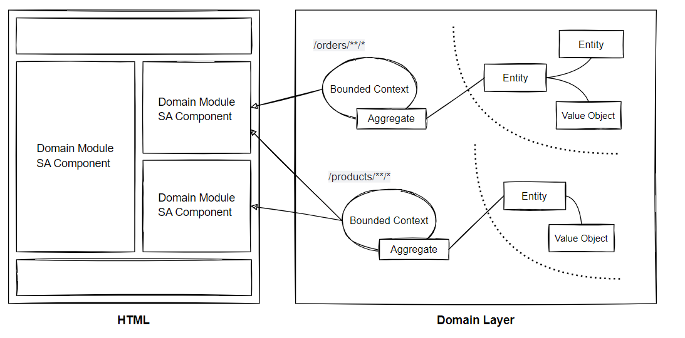
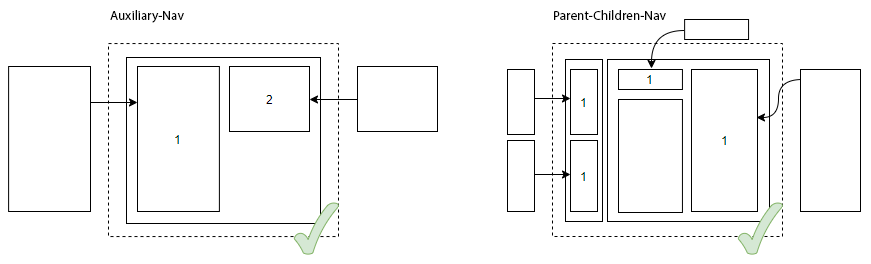

# Introduction (Work In Progress) 
A brief and practical introduction into building large-scale enterprise business applications with Angular.

# Application Architecture

Conforming to the principles of Object-Oriented Design, Domain-Driven Design and Command-Query-Responsibility-Segregation, we break down complex requirements
into logical boundaries and divide business logic into layers with different responsibilities to keep our code in good condition.

# Frontend coupled to OOD, DDD and CQRS

The building blocks of Angular already provides us with code organizational strategies. Nevertheless, to achieve a better design we will omit the
traditional data-driven approach and consider concepts of Domain-Driven Design for frontend applications:


## Object-Oriented Design

Although functional programming has gained a strong foothold in frontend development in recent years, a consistent object-oriented approach might be better
suited for TypeScript projects. Object-oriented programming allows us to develop a human-readable code base, better semantics and advanced data types. 
The Angular framework and Domain-Driven Design embrace both programming paradigms.

**» SOLID Principles**<br/>

In object-oriented programming the SOLID principles of class design helps to make better design decisions regarding high cohesion and low coupling.
Adhering to the Dependency Inversion Principle (DIP), we ensure that layers depend on abstraction as opposed to depending on concretion (Programming to an Interface).
This means, that high-level modules (Application Layer) shouldn't depend on low-level modules (Domain Layer).

**» Cross-Cutting Concerns**<br/>

Frontend applications often contain cross-cutting concerns such as logging, performance monitoring or error handling. A naive approach to implement cross-cutting
functionality usually leads to duplicated code (Code Scattering) or coupled code (Code Tangling). Dependency Injection is a pattern that can be used to handle 
cross-cutting dependencies in a loosely coupled way to prevent code scattering and code tangling.

## Applying Domain-Driven Design to Angular

A central concept of Domain-Driven Design is that the domain model is kept isolated from other concerns of the application. Ideally, the
domain model is self-contained and focuses on abstracting the business domain. Typically, frontend business applications validate business rules that
are reflected in the presentation layer - especially in SPAs when navigating through HTML forms that have dependencies in terms of composite business rules.

As an example, in an ecommerce system, say the business demands that: "No order should be accepted, if the order items are less than 3".
Adhering to this business rule, we wouldn't display the |place order| button, if the basket is empty. Other examples include offline applications (PWAs)
where a significant part of the business logic may need to be replicated to the client side. Examples of such applications are stock trading applications or tax applications.

An isolated domain layer allows us to avoid domain logic leaking into other layers or surrounding services. In addition, we don't want to command against
the server upon every user action. Therefore, considering the domain layer pattern in frontend applications sounds like a good idea!

It's fairly debatable whether higher granularity distributed across several layers introduce extra complexity in frontend applications. Consequently,
many developers tend to lean toward weaker patterns because they see it as an unnecessary practice. For most web applications MV* or Flux/Redux are patterns,
which might better meet your needs. Before starting using advanced concepts we should validate incoming requirements.

## Multilayered architecture

Considering multilayered architecture, the question arises of how to organize multiple layers in SPAs? This question refers to code splitting,
communication across layers and demanding logic from services.

The multilayered architecture in Domain-Driven Design embraces the following conceptional layers:

**» Horizontal slicing**<br/> Slicing the application into layers...


**» Vertical slicing**<br/> Slicing the application into features / use cases / bounded contexts...


Domain-oriented layering (domain modules) is often considered the first structuring criterion in Angular applications. However, for many frontend applications horizontal slicing is sufficient, 
implied that the domain is simple and only consists of few objects. The main reasons for modular segmentation in Angular applications are lazy-loading, scoping, cohesion and distribution.
With Angular 15 and the SA components API, domain modules are now optional.

**» Abstraction Layers**<br/>

- Presentation Layer: GUI Components, Widgets, UI Services
- Application Layer: Command & Query Handlers (Application Services) <br/>
- Domain Layer: Entities, Value Objects, Factories, Domain Services, Repositories <br/>
- Infrastructure Layer: 3rd-Party Libraries <br/>

**» Service Layers**<br/>

- User Interface services carry out dialog, layout navigation and interaction concepts
- Application services carry out use cases and are stateless and procedural
- Domain services carry out business processes that don't fit inside entities or value objects
- Infrastructure services provides support to separate technical concepts from business concepts <br/>

**» Validation Layers**<br/>

- Application layer - Data Validation Errors: Data types (null, undefined), format (length, empty, whitespace), schema (email, credit-card)
- Domain layer - Business Rule Violations: Business Rules, Business Invariants<br/>
- Infrastructure layer: JSON, XML serialization, HTTP Status, ERROR Handling<br/>

**» Angular Adoption**<br/>

- Presentation layer: Components, Directives, Pipes, Animations, UI Modules
- Application layer: Services, Resolvers, Guards, Validator Functions <br/>
- Domain layer: Classes, Interfaces, Services, Factories <br/>
- Infrastructure layer: Interceptors <br/>

**» Examples**<br/>

Presentation layer: *ModalDialogService, BreakpointObserver, LoadingSpinner, NavController*<br/>
Application layer: *Authentication, Search*<br/>
Domain layer: *Order, Payment, Customer, Shipment, Product, Address, Inventory*<br/>
Infrastructure layer: *Persistence, Caching, Messaging, Crypto, Converter, Translation,*
*Logging, Error, Security, Configuration, Tokens, Monitoring, Date, RuleEngine*

# Angular Core Patterns

The core patterns of Angular such as modules, services, components, factories etc. already complies with Domain-Driven Design concepts and
strives two of the most important software design principles, which are single responsibility (SRP) and separation of concerns (SoC).

## Modules

The angular.io styleguide summarizes categories to modularize code: **Shared Modules** and **Widget Modules** contain the
most common used code, while **Domain Modules** encapsulate code that isn't intended to be used outside that module
makes **Domain Modules** a good candidate for the bounded context pattern. The **Service Module** shares its content application
wide as singletons. The **Root Module** includes several domain modules. That is, the entry point is the root module. For a more
complete overview, visit the following website https://angular.io/guide/module-types#summary-of-ngmodule-categories

Angular's module system gives a clean design response:

**» Modular Architecture**<br/>


**» Examples**<br/>

`Service Module`: Application wide services as singletons e.g. *LoggerService*<br/>
`Shared Module`: Highly reusable components as non-singletons e.g. *DropDownComponent, PaginatorComponent*<br/>
`Domain Module`: Domain modules such as *OrderModule* (Bounded Context) or *SalesModule* (Bounded Context)<br/>
`Widget Module`: Highly cohesive and reusable widgets e.g. *MatSidenavModule, MatSnackBarModule* (SCAM) <br/>

**» Module Checklist**<br/>

Following checklist helps to facilitate the orchestration of ngModules:<br/>

- Every component, directive and pipe must belong to **one** and **only one** module
- **Never** re-declare these elements in another module
- **Don't** share contents of a domain module, instead add reusable elements to a shared module
- **Don't** use the providers array of a module to register global services (use provideIn)
- Module content is **private by default** and only visible to its own content
- Module content can be exported without being imported
- Module content comprises only Angular components. Interfaces, POTOs etc. aren't in the module scope
- Transitive dependencies aren't visible, **reexport** them to make them available to other modules

**» Modules vs. Standalone Components**<br/>

As the number of module types can become overwhelming and difficult to apply correctly, it can lead developers to make incorrect decisions.
Every module type serves a different purpose! In the context of domain architecture and domain partitioning, we can omit domain modules as the basis 
for our domain-oriented development approach and use standalone components available from Angular 15 (https://angular.io/guide/standalone-components).

**» Bounded Context Pattern**<br/>

The bounded context pattern divides the domain model into related domain fragments. In a service-based environment a bounded context marks the boundaries of an application service.
An application service is a concretion of the bounded context pattern! This is similar to **domain modules** where we mark the boundaries based on features. Applying the bounded
context pattern to domain modules allows us to structure Angular applications in a domain-oriented approach. Possibly the most difficult part is to draw the bounded context and aggregate boundaries.
A bounded context should consist of at least one aggregate and may consist of several aggregates. **A bounded context can be assigned either to an entire page or to page segments.**

Since a bounded context represents one or more aggregates, it's sufficient to couple the bounded context to the root URL (root-resource):
`/BoundedContextA/*API`; `/BoundedContextB/*API`.

The development team should strive to draw a context map expressing the relations between domain modules, SA components and bounded contexts:



An important consideration when modeling server-side bounded contexts is that they don't fully adhere to RESTful practices.
The interrelations between Angular, REST and DDD aggregates requires more labor which we'll discuss shortly.

**» Folder Structure**<br/>

A common practice in Angular projects is to structure the code into `/core`, `/shared`, `/features` folders according to **LIFT** and the angular.io styleguide:
https://angular.io/guide/styleguide#overall-structural-guidelines. This will be the basis for our domain-oriented folder structure:


The folder structure proposed provides inspiration for a discussion of opportunities. We may choose any design heuristic we like to structure our
application. But keep in mind, that a domain-oriented abstraction is the key.

## Models

The model in the classic MVC pattern is a representation of application data. The model contains code to create, read, update and delete or
transform model data. It stores the domain knowledge and is similar to the repository pattern!

Angular promotes two types of models:

- `View Model`: This object represents data required by a view. It doesn't represent a real world object
- `Domain Model`: This object represents data and logic related to the business domain

The view model and domain model should maintain different data structures to keep the domain model independent of presentation concerns.

**» Implementation Patterns**<br/>

- Anemic Domain Model (Write Model)
- Rich Domain Model (Write Model)
- View Model (Read Model)

The anemic domain model is often used in CRUD-based web applications as value container without any behavior of its own. However, it's considered an anti-pattern
because it doesn't contain business logic and can't protect its invariants. Furthermore, it causes tight coupling with the client code! Using behaviour-rich domain 
models prevents domain logic from leaking into other layers or surrounding services. However, if your frontend application doesn't contain any domain logic or 
business rule variations, it's totally fine to use anemic domain models and validation services! Hence, kick-off the frontend project with naked TypeScript 
objects and expand them when necessary! The following example shows the downsides of anemic domain models in frontend applications.

Domain logic is coupled to the view controller or service object:

**»  Effects of Anemic Domain Models** <br/>
```
class Employee {
    public name = 'John Connor';
    public salary = 1000;
}

@Component({
    selector: 'emp',
    templateUrl: './emp.component.html'
}) class EmployeeComponent {
    @Input() emp: Employee; 
    
    public salaryIncreaseBy(percent: number): void {
         emp.salary = (emp.salary * percent / 100) + emp.salary;
    }
}
```

In the first example, the employee class properties are public and domain logic tends to be duplicated in distant components which may lead to data corruption.
A rich domain model protects and encapsulates domain logic to ensure data consistency:

**»  Effects of Rich Domain Models**<br/>
```
class Employee {
    private name = 'John Connor';
    private salary = 1000;
    private static readonly MAX_PERCENT = 100;
    
    public salaryIncreaseBy(percent: number): void {
        if(percent > this.MAX_PERCENT) throw new Error(...);
        this.salary = (salary * percent / 100) + salary;
    }
}

@Component({
    selector: 'emp',
    templateUrl: './emp.component.html'
}) class EmployeeComponent {
    @Input() emp: Employee; 

    public salaryIncreaseBy(percent:number): void {
         emp.salaryIncreaseBy(percent);
    }
}
```

In the second example, domain logic is decoupled from the view controller class to protect the integrity of the model data.
Pushing domain logic out of view controllers down to the model layer improves reusability and allows easier refactoring. 

Consequently, using feature services for structural and behavioral modeling while domain models remain pure value containers is another
bad practice in Angular projects and known as the:

**» Fat Service, Skinny Model Pattern**<br/>

```
@Injectable()
class AccountService {
    accounts : Account[] = [{ id: 1, balance: 4500 }, { id: 2, balance: 2340 }];
    accounts$ = new BehaviorSubject<Account[]>(accounts);
    AMOUNT_MAX_VALID = 1000;
    
    constructor(private httpClient: HttpClient){}
    
    changeBalance(id: number, amount: number): void {
        if (id >= 0 && amount <= this.AMOUNT_MAX_VALID) {
            const account = accounts.find(account => account.id === id);
            account.balance = amount;
            this.accounts$.next(this.accounts);
        } else {
          throw new Error(...);
        }
    }
    
    public deposit(){}
    public widthDraw(){}
}
```

We should strive to push domain logic into entities making boundaries become more clear:

```
@Injectable()
class AccountService {

    constructor(private accountRepository: AccountRepository){}  
    
    public changeBalance(id: number, amount: number): Observable<void> {
        return this.accountRepository.findByIdOrNull(id).pipe(
          map((account: Account | null) => {
            account.changeBalance(amount);
            this.accountRepository.save(account);
          }),
          mapTo(undefined)
        )
    }
    
    public deposit(){}
    public widthDraw(){}
}

class Account {
    private id!: number;
    private balance!: number;
    private static AMOUNT_MAX_VALID = 1000;
    
    constructor(){}
    
    public getId(): number {
      return this.id;
    }
    
    public changeBalance(amount: number): void {
        if (amount > this.AMOUNT_MAX_VALID) {
           throw Error(...)
        }
        this.balance = amount;
    }
}

@Injectable()
class AccountRepository {
    private accounts : Account[] = [new Account(1, 4500), new Account(2, 2340)];
    private accounts$ = new BehaviorSubject<Account[]>(accounts);
    
    constructor(private httpClient: HttpClient){}
    
    public findById(id: number): Observable<Account> {
        return this.accounts$.pipe(
           map(accounts => accounts.find(account => account.getId() === id))
        );
    }
}
```

In the preceding example, we separated the account feature service into three layers with different responsibilities,
which has the following advantages:

- Better semantics and human-readable code
- Easier refactoring and unit testing
- Code reusability and discoverability
- Protection of invariants and data integrity
- Reactive state can be attached to any other component
- Single storage unit for (immutable) data structures

So far, it may seem like a lot of code for a small payoff. However, as your frontend application grows and becomes large in its lifespan,
the logical separation approach is adding more and more value to your software project. In agile processes like Scrum where requirements
remain unknown for a long time, it's hardly possible to tell from a few days or even a few weeks of what the upcoming sprints will bring.
Hence, choosing the right design approach at the beginning of a software project is almost impossible. Later, we'll discuss the service layer pattern 
in form of application-, domain- and infrastructure services conform to Domain-Driven Design practices.

Put simply, working with a rich domain model means more entities than services. Building behavior-rich domain models is a major objective in object-oriented design.
However, encapsulating domain logic in entities with the agreement of possibly several consumers (components) to commit to the same business rules is essential!

**» Domain Model (Aggregate Pattern)**<br/>

The domain model entities contain data and behavior modeled around the business domain.
In terms of Domain-Driven Design and CQRS, the domain model entity is an aggregate that contains only write operations that result in state transitions.

Example of a Domain Model Entity (CQS):

```
class Order {
    private customerId;
    private quantity;
    private totalCost;
    private deliveryAddress;

    contructor(){}
    
    public getCustomerId(){}
    public getTotalQuantity(){}
    public changeDeliveryAddress(){}
    public createCustomer(){}
    public createAddress(){}
}
```

In classic object-oriented design (real-world design) the software model lacked of explicit boundaries. Relationships between classes brought a complexity that required an efficient design.
The DDD aggregate pattern takes a contextual approach by facilitating groupings of entities and value objects that are modeled around business rules and consistency boundaries. 
One of the most important aspects of the aggregate pattern is to protect it from having an inconsistent state.

**» Aggregate Entity Checklist**

- It's a top-level business object 
- It's bounded from the viewpoint of a use case
- It's based on a root entity and typically acts as a cluster of related domain entities and value objects
- It has global identity (ID), state, lifecycle and serves as a consistency boundary
- It validates all incoming actions and ensures that mutations don't contradict invariants
- The internal state may only be mutated by the aggregate's contract  
- References of inside objects are never passes to the outside world, they encapsulate access to children
- Outside objects can't make changes to inside objects but inside objects can hold references to outside objects
- Each use case modifies only one aggregate but can use other aggregates to retrieve information
- Each aggregate root entity gets its own repository service
- It shouldn't inject dependencies in the constructor because it makes unit testing more difficult
- The internal object graph should be no more than two levels deep
- It doesn't expose `getters` and `setters` to protect internals 
- Inter-Aggregate invariants can be placed in domain services
- Value Objects are modeled as record types, they have no ID and are never part of a collection
- Aggregate relations hold by IDs are incorporated through factory methods

The aggregate entity spans objects that are relevant to the use case and its invariants. They are treated as independent entities
if they don't share invariants in the domain:


**» From the Viewpoint of Frontend Development**

- Aggregates don't need to publish domain events due to reactive state management
- Aggregates provide predictable state through transactional consistency boundaries
- Aggregate references hold by ID or object references are dependent on the Web API interface 
- If the backend isn't aware of CQRS or BFF, frontend aggregates serve as the basis for tailoring view models
- Encapsulation can be broken when processing view model mappings

**» Routing, REST and DDD Aggregates**<br/>

Since the navigation pattern of the Angular router engine adheres to the navigational behavior of hypermedia systems (HATEOAS) where URIs identify linked resources conform to RESTful
practices, we must reexamine the idea of creating client-side aggregates. As an aggregate represents a group of related domain entities and value objects, wouldn't we then have to group
linked resources in the frontend?

In the traditional data-centric approach, database tables and their relationships are pictured on a resource model. But is this common and always true?
Well, it all depends on the use case and how we interpret a REST resource! A REST resource might be a representation of a single entity, database table or a materialized view.
But how do we map a REST URL like `/addresses/22` to a client-side aggregate like `/orders/4` or `/customers/54`?

When consuming fine-grained REST interfaces, we might have to piece together linked resources to create an aggregate for each initial routing event. Subsequently, an application service or
repository service provides the contract to all transactions. In this scenario, the repository service acts as an anti-corruption layer to the underlying
resource model. Unfortunately, this approach doesn't play well, since the creation of an aggregate on the client side could result in countless additional HTTP requests
(N + 1 Problem)! **Hence, the aggregate entity should be negotiated with the Web API as a conceptual whole!** We still can configure sub resource URLs like `/order/{id}/items/{id}` in the
router configuration to enable in-app-navigation.

Even in the case of server-provided aggregates, it just doesn't feel quite right! **First, we shouldn't provide a pure domain entity to the client side**. Secondly, if
the server-provided aggregate e.g. order aggregate `GET : /orders/22` already contains related data like the delivery address, then how do we update the delivery address?

Either we call a method of the order aggregate `Order.updateDeliveryAddress(newAddress)` and subsequently process an HTTP update command: `PUT : /orders/22 : {order:{deliveryAddress...}}`
or we ask a dedicated REST endpoint for updating the delivery address: `PUT : orders/22/addresses/5 : {deliveryAddress:{...}}`. Finally, the server-side request handler persists the payload to the database.
The second approach seems to contradict the basic idea of an aggregate avoiding to reveal its internal state when providing a separate addresses resource endpoint like `GET : /addresses/22`.

Since the address resource is contextless, we shouldn't promote REST URLs like `/addresses/5`! As an example, calling `DELETE : /addresses/5 : {address:{id:5}}` might delete the address data
of an ongoing order process! But now here's a question: can an address exists outside an order or customer context?

Navigating a fine-grained resource-oriented interface or adhering to the aggregate pattern has a big impact on the frontend architecture!
For more information about the downsides of REST interfaces, visit the following website: https://www.howtographql.com/basics/1-graphql-is-the-better-rest/

The aggregate entity should be negotiated with the Web API as a conceptual whole:


**» Design Considerations**

Q: How can a GUI designer help to reduce the requests for aggregates?<br>
A: By defining GUI patterns that adhere to the navigational behaviour of hypermedia APIs!

**» View Model**<br/>

View models are mere data objects and usually don't contain any domain behavior, but they can use domain services or specifications to compute values.
View models are supportive in providing data and presentation logic to the presentation layer. They are typically created by merging two or more 
existing entities into one entity and are an essential part of every good frontend architecture.

The view model should hold the data necessary to render the view if:

- View demands a subset of one or more domain model properties
- View demands additional properties mixed up with view related properties

**» View Model Checklist**<br/>

- Can be placed in the domain layer or application layer 
- Can use domain entities, domain services or specifications to compute values
- Can use the `inject()` function to inject dependencies like domain services etc.
- Can behave like a Rich View Model that contains presentation logic methods
- Can also behave like a value object, also called a DTO that is immutable
- Can be tailored in a command or query handler, view controller, factory or data mapper 
- The name ends with the suffix -View or -ViewModel e.g. UserProfileView, UserListView, UserDetailsView
- Contains only `string` properties relevant to the view bindings, which improves performance

**» Example**

```
class OrderViewModel {
    private _orderId: string;
    private _total: string;
    private _balance: string;
   
    get total(){}
    set total(data) { this._total = this.format(data) }
    get balance(){}
    set balance(data) { this._balance = this.calc(data) }
    
    constructor(){}
    
    private format(){}
    private calc(){}
}

const newOrderViewModel = new OrderViewModel()
newOrderViewModel.total = 444;
newOrderViewModel.balance = -44;
```

In the preceding example, data transformation and validation takes place in the same view model class. A better approach would be to use a dedicated component such as a 
factory, validation service or an abstract super class that processes view-related transformation and validation. In this way, we decouple the transformation responsibilities to facilitate code 
reusability.

```
abstract class ViewModel {

    constructor(){}

    protected format(){}
    protected calc(){}
}

class OrderViewModel extends ViewModel {
    private _orderId: string;
    private _total: string;
    private _balance: string;
     
    get total(){ return this._total; }
    set total(data){ this._total = this.format(data); }
    get balance(){ return this.balance; }
    set balance(data){ this._balance = this.calc(data); }
    
    constructor(){
      this.super();
    }
}

const newOrderViewModel = new OrderViewModel()
newOrderViewModel.total = 444;
newOrderViewModel.balance = -44;
```

Due to performance implications, it is not recommendable to bind `getters` in the view template. Instead, we favor public properties.

Hardcoding transformation methods in the view model class causes tight coupling. A better approach is to process data transformations such as *filtering*, *sorting*, *grouping* or *destructuring* etc.
in a reactive stream and hand over the required properties to an object factory or view model.

```
public getViewModel(): Observable<ViewModel> {
    return this.repository.getAll()
    .pipe(
      filter(...),
      groupBy(...),
      distinct(...),
      mergeMap((...)=>{
         return of(new ViewModel(...))             
      })
    )
}
```

**» Factory Pattern**<br/>

Objects can be constructed using regular constructors or factories. The object factory pattern helps to create complex objects like aggregates that involve the
creation of other related objects and more importantly assist in type safety when type information get lost resulting from ES6+ features such as *spread*, *rest* or *destructuring*.
Object factories assist with immutability by providing new objects when needed. Furthermore, we can put constraints and validation logic in factories to avoid unnecessary object instantiations in the entire project.

Example 1

```
class OrderFactory {
    public static create() {
      return new Order();
    }
    private static validate(){}
    public static clone(order: Order) {}
    public static deepClone(order: Order) {}
}

const newOrder = OrderFactory.create();
newOrder.propertyA = ...
newOrder.propertyB = ...
```

Example 2

```
interface IOrder{
    status: OrderStatus;
}

class Order {
    public status!: string;

    private constructor();
    private constructor(props: IOrder);
    private constructor(props?: IOrder){
        if(props){
            this.status = props.status;
        }
    }
    
    public static create(props: IOrder): Order {
        // if(!props) return new Order();
        return new Order(props);
    }
    
    public static empty(): Order {
      return new Order();
    }
    
    public toJSON(): object {
        return serialized;
    }
    
    public toString(): string {
        return stringified;
    }
}

const newOrder = Order.create({status:OrderStatus.Pending});
const jsonOrder = newOrder.toJSON();
```

Piecing together both concepts:

```
abstract class ViewModel {

    constructor(){}
    
    protected transformPrice(price: string): string {
      return `${price}€`
    }
}
 
interface IProductViewModel {
    id: number;
    name: string;
    price: string;
    type: string;
    active: boolean;
};

class ProductViewModel extends ViewModel {
    public id!: number;
    public name!: string;
    public price!: string;
    public type!: string;

    private constructor(props: IProductViewModel) {
      super();
      this.price = this.transformPrice(props.price); 
      ... // set or transform other properties
    }
    
    private static canNotCreate(props: IProductView): boolean {
      // validate props and return result
    }
    
    public static create(props: IProductViewModel): Readonly<ProductViewModel> {
      if (this.canNotCreate(props)) {
          throw Error("Can not create ProductViewModel");
      }
      return new ProductViewModel(props) as Readonly<ProductViewModel>;
    }
}

cosnt productViewModel = ProductViewModel.create({
    id: 1,
    name: 'screw',
    price: '28',
    type: 'pans'
});
```

**» Factory Checklist**<br/>

- Validates constraints before expensive objects are instantiated
- Encapsulates complex object creations toward better testability and readability
- Forces the development team to clone objects in a predetermined way
- Can be used for domain models as well as for view models
- Can help to provide and manage dependencies (domain services)

**» Data Mapper Pattern**<br/>

With a higher-functional model layer, we need to take the mapper pattern into consideration. A common practice to ensure type safety is to create interfaces 
for plain JSON object literals. In the context of mapping, it's important to make a distinction between the typing system (1:1 mapping) and the object structure (n:m mapping).

Mapping JSON-encoded server data in the frontend is mandatory if:

- The model object defines any methods
- The schema of the Web-API is different from its representation in the application
- The chosen typing system favors classes over interfaces and type aliases

The Mapper Pattern transfers data between two different schemas:


Let's have a look at how to map the server response schema to domain entities:

```
read(): Observable<Customer[]> {
    return this.http.get<Customer[]>("/api/customers")
        pipe(
            map((customers: Customer[]): Customer[] => {
                let result: Customer[] = [];
                customers.forEach((customer:Customer) => {
                    result = [new Customer(customer.firstName, customer.lastName), ...result];
                });
                return result;
            }),
            catchError(()=>{})
        );
};
```

The data mapper can be reused anywhere in the application to elaborate the preferred entity type.

**» Structural Mapper Pattern**<br/>

The structural mapper pattern performs a bidirectional transfer of data structures between two objects. 

When populating arrays, the mapping implementation ensures type safety by using class instances instead of JSON object literals. 
Interfaces will only be used as contracts between the target and the source object. 

Option 1 - Constructor Assignment

```
interface IOrder {
    id: number;
    status: Status;
    total: number;
}

class Order {
    public id; 
    public status; 
    public total;
    
    constructor(data: Partial<IOrder>) {
       this.id = data.id;
       this.status = data.status;
       this.total = data.total
    }
}

const orders = [new Order({id:22,status:Status.Pending,total:450})];
```

Option 2 - Constructor Assignment with ES6+

```
class Order {
    public id; 
    public status; 
    public total;
    
    constructor({ id, status, total = 0 }: Partial<IOrder>) {
        Object.defineProperty(this, 'id', { value: id, writable: false });
        Object.assign(this, { status, total });
    }
}

class Order {
    public id; 
    public status; 
    public total;
    
    constructor({ id, status, total }: Partial<IOrder>) {
        Object.defineProperties(this, {
            id: { value: id, writable: false },
            status: { value: status },
            total: { value: total },
        });
    }
}

const orders = [new Order({id:22,status:Status.Pending})];
```

Option 3 - Constructor Assignment with Index Signature

```
class Order {
    [key: string]: any;
    
    constructor(input: { [key: string]: any }) {
        Object.keys(input).forEach((k: string) => {
            this[k] = input[k];
        });
    }
}

const orders = [new Order({id:33,status:Status.PENDING})];
```

Abstract super class to decouple the constructor assignment:

```
abstract class IOrder {
    [key: string]: any;

    constructor(input: { [key: string]: any }) {
        Object.keys(input).forEach((k: string) => {
            this[k] = input[k];
        });
    }
}

class Order extends IOrder {}

const orders = [new Order({id:33,status:Status.PENDING})];
```

Unfortunately, index signature assignments don't support access modifier (public, private, protected).

Option 4 - Mapper Assignment

```
class OrderMapper {

    constructor(){}
    
    public static mapToOrder(Order, Dto): Order {
        Order.id = Dto.id;
        Order.status = Dto.Status;
        Order.total = Dto.total;
        return Order;
    }
    
    public static mapToOrderView(Order, Dto): Dto {
        Dto.id = Order.id;
        Dto.status = Order.Status;
        Dto.total = Order.total;
        return Dto;
    }
}

const orders = [OrderMapper.mapToOrder(new Order(), {id:33,status:Status.PENDING})];
```

Option 5 - Builder Pattern

```
class Order {
    public id;
    public status;
    public total;
    public address: Address;
    public customer: Customer;
    
    constructor(){}
    
    public setAddress(newAddress: Address): this {
        this.address = new Address(newAddress);
        return this;
    }
    
    public setCustomer(newCustomer: Customer): this {
        this.customer = new Customer(newCustomer);
        return this;
    }
}

const orders = [new Order().setAddress({...}).setCustomer({...})];
```

**» Mapper Checklist**<br/>

- Bidirectional mapping is important when using model-driven forms
- The mapper pattern in the repository service assists to create pure models 
- The mapper pattern in the application service assists to create view models
- Don't create view models in the repository service because it may require multiple sources

**» REST, HATEOAS & Mapping**<br/>

When building multi-layered web applications, data transformation is among the major challenges that occur when data traverses all layers - 
data flows up and down the stack! If the domain layer needs to be replicated to the client side, then a transformation of the server response 
schema to the domain model is unavoidable:


For example, HATEOAS embraces hyperlinks between external resources to make transitions through the applications state by navigating hyperlinks.
However, mapping hyperlinks to a client-side domain model is hardly possible! When consuming REST interfaces, very often multiple HTTP requests need to be processed
asynchronously to create a model for a specific view pattern. If the HATEOAS pattern used, forms hyperlinks in the response schema, it 
could have a negative impact to the presentation layer. **UX engineers usually don't model their interaction-, navigation- or 
screen patterns around hypermedia APIs**. In addition, the Angular router engine doesn't play well with the URI templates of hypermedia formats. HATEOAS decouples
the backend from the frontend, but it couples the frontend to the backend. Although the Angular router engine adheres to the navigational behaviour of hypermedia systems,
we should avoid HATEOAS for SPA applications!

## Services

Singleton services are important conceptual building blocks in Angular applications. Most of the functionality that doesn't belong to view components typically
resides in the service layer. We will implement the service layer pattern in form of application-, domain- and infrastructure services conform to Domain-Driven Design practices.

**» Application Service Objects**<br/>

The purpose of an application service is to orchestrate workflows and to define the use cases of the application.

- They don't represent domain concepts, and they don't implement business logic
- They are stateless and procedural, but sometimes need to hold state of a business flow like "tasks in progress"
- They may use a domain service to perform a domain-specific task
- They are also the place to elaborate view models out of domain state
- Application service methods are also called command or query handlers

```
@Injectable()
class ApplicationService {

  constructor(private repository: Repository){}

  firstUseCase(){}
  secondUseCase(){}
  firstViewModel(){}
  secondViewModel(){}
}

Example:

@Injectable()
class OrderService {

  constructor(private orderRepository: OrderRepository){} 

  placeOrder(): void{}
  cancelOrder(): void{}
  trackOrder(): void{}
  confirmOrder(): void{}
  fullfillOrder(): void{}
  getOrderForSalesView(): OrderForSalesView{}
  getOrderForListView(): OrderForListView{}
  getOrderForDetailsView(): OrderForDetailsView{}
}
``` 

When application services carry out use cases of the application, it might be a good idea to implement use cases that contain less logic directly in the view controller, 
like in the MVC pattern. However, we don't want to hide use cases from the rest of the application! In addition, we might want to share logic with other Angular artifacts 
such as *resolvers, guards, components or interceptors*. The main reason why we favor application services over view controllers is because during router navigation our 
components will be destroyed. 

**» Domain Service Objects**<br/>

The purpose of a domain service is to provide a set of business tasks that don't fit inside entities or value objects.

- They perform operations and calculations requiring input from multiple domain entities to validate composite business rules 
- They may transform domain object compositions to return new object representations
- They have no identity, and they are stateless and procedural
- They can be reused in other application use cases
- It can use a domain entity, or a domain entity can use a domain service
- Repositories are domain services, if not applicable to the *dependency rule*
- Domain services don't just perform *RUD operations, which belongs to the repository service

```
@Injectable()
class DomainService {

  constructor(private repository: Repository){}
  
  firstBusinessTask(){}
  secondBusinessTask(){}
}

Example:

@Injectable()
class MoneyTransferService {

  constructor(private accountRepository: AccountRepository){}
  
  transferMoney():void{}
  calculateTransferCosts():number{}
}
``` 

Sometimes it's difficult to make a clear separation between application services and domain services. An important indication here is that the name of 
the service isn't the decisive factor but rather the task that needs to be performed. When in doubt, we can omit domain services. 

**» Infrastructure Service Objects**<br/>

The purpose of an infrastructure service is to provide cross-cutting and technical concepts to other layers such as tracing, messaging or persistence.
They should never call a domain entity, but they can be called from domain entities - one way dependency!

**» Stateful Services vs. Stateful Repositories**<br/>

As discussed thoroughly, it's common for Angular projects to create feature services for business logic and state management.
We typically create stateful services, if we need to share data across components or process HTTP requests and responses that perform CRUD operations.

Adhering to Domain-Driven Design concepts, we'll apply the repository pattern in favor of an active data store. The repository pattern acts as a reactive storage unit
for globally accessible data that can be used by other independent components. Repositories aren't only for entities, but for all types of objects
including view models. Repositories often act as an anti-corruption layer enabling us to create objects without their structure
being influenced by the underlying API.

In addition, we'll also apply the CQRS pattern to stem the heavy-lift when building complicated page flows and user interfaces.
The CQRS pattern helps to satisfy different view patterns with the respective data model. State transitions are immediately reflected 
to the view model (read side).

A reactive API exposes observables to manage the complexity of asynchronous data processing. If we share data with
other components, we must keep track of state transitions to prevent stale data and to keep the view in sync. RxJS provides us great operators to
implement the projection phase between the read and write side, which we'll discuss shortly as "Projection Patterns".

## CQRS

With traditional CRUD-based web applications conform to the REST architectural style and the single data model approach, we may fall into the situation
where we need to piece together multiple resources to provide a rich (view) model. Developers often use view controller methods to accomplish this task:


The domain model focuses on business logic, not presentation needs. Using a view model provider to manage complicated page flows and user
interfaces allows us to query data for specific view patterns. A view model provider is the perfect place to pre-compute filtering and 
sorting logic (https://angular.io/guide/styleguide#style-04-13). That is, the CQRS pattern helps to avoid over-bloated all-in-one models!
The CQRS pattern may overcomplicate the application design, instead of simplifying it. Use it with care!

CQRS in the frontend has many advantages:

- Separating concerns of each data model
- Unidirectional data flow
- Immutable view models comply with the `.onPush` strategy
- sort() and filter() pipes can be detached from templates (https://angular.io/guide/styleguide#do-not-add-filtering-and-sorting-logic-to-pipes)

The view model provider may appear in different forms. It may appear in form of a query method, a resolver or a query object:

**» CQS using Feature Services**

Using a single feature service (Repository) for writes and reads:


```
@Injectable()
class ProductsService { 

    private selectedProductIds = [1,2,4,9];
    private products = [new Product(1, 'Computer', 1234$'), new Product(2, 'Shoes', 120$')];
    private selectedProductIds$ = new BehaviorSubject<number>(selectedProductIds);
    private products$ = new BehaviorSubject<Product[]>(products);
    
    private selectedProductListView$ = this.products$.pipe(
        combineLatestWith(this.selectedProductIds$),
        map(([products, selectedProductIds]: [Product[], number[]]) => {
            return products.map((item: Product) => {
                return ProductListView.create({
                    ...item,
                    active: selectedProductIds.includes(item.id),
                });
            });
        }),
        shareReplay(1)
    );
         
    public createProduct(){}   
    
    public updateProduct(){}
    
    public deleteProduct(){}
    
    public getSelectedProductListView(): Observable<Readonly<ProductListView>[]> {
        return this.selectedProductListView$;
    }
    
    public addToSelectedProducts(id:number): void {
        this.selectedProductIds = [...selectedProductIds, id];
        this.selectedProductIds$.next(this.selectedProductIds);
    }
}
```

The single feature service approach makes it difficult to gather data from multiple sources and can lead to circular dependencies when injected to other feature services.

**» CQRS using Feature Services for Writes and Reads**


**» CQRS using Command and Query Handlers and DDD Tactical Patterns**<br/>


```
@Injectable()
class CommandHandlers {
   
  constructor( 
      private repository: Repository                                                   
      ){}
      
  handleUseCaseCommand1(cm1): void {}
  handleUseCaseCommand2(cm2): void {}
}

@Injectable()
class QueryHandlers {

  constructor(         
      private repository: Repository             
      ){}

  handleUseCaseQuery1():ViewModel1 {}
  handleUseCaseQuery2(qm):ViewModel2 {}
}
```
**» CQ(R)S using Application Services**<br/>

Typically, an application service provides query handlers to provide view models out of domain state. 


Reactive workflow of an application service:


This might seem more complex than just using a single feature service for business logic and state management. A fixed layered architecture style would likely 
be perceived as overkill for small applications and can lead to a layered cake anti-pattern. The level of abstraction is up to the developer and the incoming requirements.
However, in agile processes like Scrum where requirements can't be foreseen, it would be more efficient to take the risk and add a possibly unnecessary pass-through layer. "You are gonna need it"!

**» CQRS using the Command Pattern**<br/>

@TODO [text]
@TODO [image]

**» View Model Provider Patterns**<br/>

There's another problem when it comes to creating view models. We may need to expose internal state and private properties of domain entities 
in order to map to view models! With the *projection by entity* pattern we define a special contract for mappings:


Factory methods define the contract for view model mappings:

```
class Order {
    private orderId: number;
    private quantity: number; 

    public getOrderForSalesView(): OrderForSalesView {
        return new OrderForSalesView(this.quantity);
    }

    public getOrderForCatalogView(): OrderForCatalogView {
        return new OrderForCatalogView(this.orderId);
    }
}

const OrderForCataglogView = new Order().getOrderForCatalogView();
```

Elaborating view models directly in domain entities violates the single responsibility rule!
We can remove the factory methods using an abstract class:

```
abstract class OrderViewModel {
    abstract orderId: number;
    abstract quantity: number;

    public getOrderForSalesView(): OrderForSalesView {
        return new OrderForSalesView(this.quantity);
    }

    public getOrderForCatalogView(): OrderForCatalogView {
        return new OrderForCatalogView(this.orderId);
    }
}

class Order extends OrderViewModel {
    private orderId: number;
    private quantity: number; 
}

const OrderForCataglogView = new Order().getOrderForCatalogView();
``` 

If a view model requires multiple sources, we can build a dedicated class in form of a query handler service to provide view models for individual view patterns.

```
@Injectable()
class OrderQueryHandlers {
   
    constructor(
      private orderRepository: OrderRepository,             
      private productRepository: ProductRepository,
      private customerRepository: CustomerRepository,                             
      private translateService: TranslationService              
      ){}

    public getOrderStatusViewByStatus(status:string): Observable<OrderStatusView> {
        return this.orderRepository.getAll()
        .pipe(
          filter(status),
          groupBy(...),
          distinct(...),
          map((...)=>{
             return translateService.translate(...);             
          }),
          mergeMap((...)=>{
             return of(new OrderStatusView(...));             
          })
        )
    }
    
    public getOrderDetailsViewByProductId(id:number): Observable<OrderDetailsView> {
        return this.productRepository.getAll()
        .pipe(
          combineLatestWith(this.orderRepository.getAll());
          map(([d1, d2]),
          filter(...),
          groupBy(...),
          mergeMap([...]) => {
            return of(new OrderDetailsView(...));           
          })
        )        
    }
}
```

The view model provider can also be reused in any Angular service!

# State Management

With single page applications (SPAs), we get the flexibility and cross-platform functionality of web applications as well as the
client state management of native applications. Typically, SPAs have more complex state than traditional server-side applications.
In Angular applications, stateful services are first-class citizens for sharing state across components. The state management
concept in Angular is exclusively handled through RxJS. RxJS is arguably the most powerful reactive state management library available.

There are many state types to deal with:

| Type              | Example                  | Location                                | 
|-------------------|--------------------------|-----------------------------------------|
| Domain State      | Entity, Resource, Model  | Im-Memory, Browser Storage API          |
| View State        | Position, Panel, Zoom    | Im-Memory, Browser Storage API          |
| Router State      | /?sort /?filter /?search | Browser History API                     |
| Draft State       | Comments, Mails          | In-Memory, Browser Storage API          |
| Session State     | Tokens, Keys             | In-Memory, Browser Storage API, Cookies |
| Application State | Online/Offline           | Browser API                             |
| ERROR State       | throw new Error()        | Client / Server                         |

## Domain State

**» Entity Pattern**<br/>

Create an entity or model to manage the domain state of an application:

```
class Customer {
    private firstName: string;
    private lastName: string;
        
    get firstName(): string{}
    set firstName(): void{}
    get lastName(): string{}
    set lastName(): void{}
    
    public isLoggedIn():boolean{}
}
``` 

**» Shared Repository Pattern**<br/>

The shared repository pattern provides a central storage unit where we share state and communicate state transitions along with transformations and HTTP requests.
In the context of Domain-Driven Design, the repository pattern is a layer between domain objects and the database. It's used as a source of domain
objects and provides the abstraction over data access (Data Access Layer - DAL). 

However, from the viewpoint of frontend development, the question arises of **where to store view related state** such as a user-selected table row?
Ensuring that view state doesn't leak through surrounding services, we endorse to store the domain related view state in the last layer of dataflow as well, that is, the repository.
Storing view state in application services can lead to circular dependencies and very complex relations. Unlike the Redux pattern where state is located in one single centralized store, 
we'll apply the repository pattern as the data IO design strategy. Repositories can be used for all types of objects including view model objects or view properties.

Angular's built-in change detection allows us to synchronize state transitions through `getter` methods. However, RxJS observables provide more flexibility and simplifies
asynchronous data processing for complex requirements.

Let's have a look at how to define a highly reactive shared repository (CQS):

```
const customers : Customer[] = [
    new Customer(1, "Peter", "Hanson", CustomerType.NEW, new Address("Chinatownstreet 22a, China"));
    new Customer(2, "Tango", "Ocean", CustomerType.PREMIUM, new Address("5th Avenue, USA"));
    new Customer(3, "Michael", "Johnson", CustomerType.REGULAR, new Address("21 Jumpstreet, USA"));
]

@Injectable()
export class CustomerRepository {
    private customerFilter = new BehaviorSubject<string>('name');
    private showCustomerCode = new BehaviorSubject<boolean>(false);
    private selectedCustomer = new BehaviorSubject<Customer>(null);
    private customers = new BehaviorSubject<Customer[]>(this.customers);
       
    constructor(private httpClient: HttpClient, private customerMapper: CustomerMapper){...}
    
    public count(): Observable<number>;
    public contains(...): Observable<boolean>;
    public findById(...): Observable<Customer>{};
    public findBySalaryType(...): Observable<Customer[]>{};
    public findByCriteria(criteria: CriteriaQuery): Observable<Customer[]>
    public findByCategory(...): Observable<Customer[]>{};
    public groupBy(...): Observable<Customer[]>{};
    public add(...): Observable<void>{};
    public save(...): Observable<void>{};
    public update(...): Observable<void>{};
    public delete(...): Observable<void>{};
    public filter(...): Observable<Customer[]>{};
    public freeTextSearch(...): Observable<Customer>{};
    public setSelectedCustomer(...): Observable<void>{};
    public setCustomerFilter(...): Observable<void>{}
}

* Casting with .toObservable() is recommended but not required for TypeScript applications
```

Of course, we can create generically typed repository interfaces:

```
interface Repository<T, K> {
    findById(id: K): T;
    save(entity: T): K;
}

@Injectable()
class CustomerRepository implements Repository<Customer, number> {
    constructor(){}
}

@Injectable()
class CustomerRepository extends PagingAndSortingRepository<Customer, number>
    constructor(){}
}
```

**» Repository Checklist**<br/>

- Represents a reactive in-memory collection of objects
- Uses the HTTP API to communicate the backend server
- Defines the contract for reads and writes 
- Contract excludes the creation of object 
- Contract only allows to query aggregates
- Doesn't contain a collection of value objects
- Is the place to elaborate pure models out of server DTOs

## UI State

Build a service or repository anytime a component needs to stash away some property values or for communication with itself.

Let's have a look at how to define UI services:

```
@Injectable()
export class BreakpointObserver {
    public matches(...): Observable<boolean>{};
}
```

Sometimes it's difficult to draw the boundaries between UI services and application services. For example, is a BreakpointObserver more of a UI service or
an application service? Typically, application services are stateless and orchestrate use cases of the application!

## Router State

The Angular router engine helps to manage application state. Put simply, the router determines which components are visible on the screen, and
it manages navigation through the application state. Any state transition results in a URL change! When building a router-based SPA, we should commit to
User-Centered Design (UCD), where user actions define the navigation flow. UX-Driven Design helps to determine the appropriate Web API interface.
The Logical User-Centered Interaction Design (LUCID) methodology is a great way to facilitate UX-Driven Design.

# Component Tree Design

As the first step, we should mind about the component hierarchy and sketch wireframes alongside the component tree. 
The top-down flow ensures that the UI storyboard is compatible with the Web API interface. 

`Information Architecture` &rarr; `Interaction Design` &rarr; `Visual Design` &rarr; `Usability Testing`


## Customizing

When deciding on a design, customizing the look of default components can quickly become challenging.
Creating frontends that feature modular and reusable CSS without overriding existing CSS rules is an important part of
every frontend project. Usually every component in an Angular project appears in the default style and serves a singular purpose.
Design adjustments for reusable components to specific content areas can be implemented with the `:host()` and `:host-context()` selectors.


Unfortunately the `:host-context()` CSS pseudo-class function lacks browser support. Luckily, Angular supports an emulated version
using the default settings of the *view encapsulation* mode.

## Navigation Patterns

As layout complexity increases with screen resolutions, it requires careful considerations when starting from a mobile-first approach
and then scaling up to desktop layouts. Traditional desktop layouts require more complex interaction and navigation patterns because UX designers
typically focus on usability and don't care about RESTful practices. As discussed thoroughly, the Angular router engine 
adheres to the navigational behavior of hypermedia systems with which we have limited possibilities regarding individual navigation patterns.

Angular router navigation patterns:


With the *sibling-nav* and *parent-child-nav* patterns we're adhering to RESTful practices. The *Auxiliary-Nav* and *Parent-Children-Nav* patterns enable 
us to load multiple components simultaneously, but brings limitations.



Pathless or component-less routes are a good way to share data between sibling components. This kind of routes provide a way
to load multiple components at a time. However, deep-linking isn't supported as known. Workarounds can help to allow
deep-linking to some extent. By checking route params in named router outlets or by intervening with
resolvers or guards. If helper properties evaluate to true, we'll display the component:

`<router-outlet *ngIf="id==='22'" name='employee'></router-outlet>`

The pathless routing strategy hasn't been well documented, especially when it comes to deep-linking it may lead to unexpected behavior.
Auxiliary routes should be addressed in any use case that requires a few components to be initiated in parallel at random places. 
The router engine is better suited for mobile navigation patterns.


# Business Rule Validation & ErrorHandling

@TODO [text]
@TODO [image]

# Summary

With multi-layered SPAs it becomes clear that critical decisions have to be made upfront.
Most of them are dependent on requirements at macro-level, which includes decisions in the scope of:

- SPA vs. MPA vs. MDI
- UX-Driven vs. Domain-Driven vs. Data-Driven
- Smart Client vs. Dump client
- Public vs. Private Web API
- Mobile first vs. Desktop first
- Offline first vs. Online first
- Functional Programming vs. Object-oriented Programming
